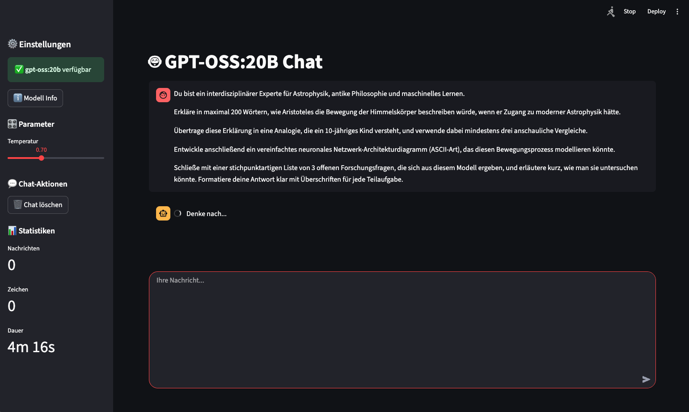

# GPT-OSS:20B Streamlit Chat

Eine interaktive Chat-Anwendung mit dem GPT-OSS:20B Modell über Ollama und Streamlit.

## Screenshot



## Voraussetzungen

- Python 3.8+
- Ollama installiert und laufend
- Das GPT-OSS:20B Modell in Ollama verfügbar

## Installation

1. **Repository navigieren:**
   ```bash
   # Navigieren Sie zu Ihrem Projekt-Ordner
   cd ~/Documents/Projects/gpt-oss-20b
   # oder verwenden Sie den vollständigen Pfad zu Ihrem Projekt
   ```

2. **Virtuelle Umgebung aktivieren:**
   ```bash
   source .venv/bin/activate
   ```

3. **Abhängigkeiten sind bereits installiert** (streamlit, ollama, python-dotenv)

## Neue Installation (falls erforderlich)

Falls Sie das Projekt an einem anderen Ort einrichten möchten:

```bash
# 1. Projekt-Ordner erstellen und navigieren
mkdir -p ~/Documents/Projects/gpt-oss-20b
cd ~/Documents/Projects/gpt-oss-20b

# 2. Virtuelle Umgebung erstellen
python -m venv .venv

# 3. Virtuelle Umgebung aktivieren
source .venv/bin/activate

# 4. Abhängigkeiten installieren
pip install streamlit ollama python-dotenv

# 5. .env Datei erstellen (siehe Konfiguration unten)
```

## Ollama Setup

1. **Ollama starten:**
   ```bash
   ollama serve
   ```

2. **GPT-OSS:20B Modell herunterladen:**
   ```bash
   ollama pull gpt-oss:20b
   ```

3. **Verfügbare Modelle prüfen:**
   ```bash
   ollama list
   ```

## Konfiguration

Die Konfiguration erfolgt über die `.env` Datei:

```env
# Ollama Configuration
OLLAMA_HOST=http://localhost:11434
OLLAMA_MODEL=gpt-oss:20b

# Streamlit Configuration  
STREAMLIT_HOST=localhost
STREAMLIT_PORT=8501
```

## Anwendung starten

### Einfach starten
```bash
./start.sh
```
Das Script findet automatisch einen verfügbaren Port (startet bei 8501)

### Manuell starten
```bash
source .venv/bin/activate
streamlit run app.py --server.port 8501
```

Die Anwendung ist dann verfügbar unter: **http://localhost:8501** (oder dem nächsten verfügbaren Port)

## Features

- 🤖 **Streaming Chat**: Echtzeitantworten vom GPT-OSS:20B Modell
- 🎛️ **Parameter-Kontrolle**: Temperatur und andere Einstellungen anpassbar
- 💬 **Chat-Verlauf**: Automatische Speicherung während der Session
- 📊 **Live-Statistiken**: Nachrichten, Zeichen, Session-Dauer
- 🔄 **Modell-Management**: Automatische Prüfung und Laden von Modellen
- 🗑️ **Chat-Kontrolle**: Chat löschen und neu starten
- ⚡ **Fehlerbehandlung**: Automatische Überprüfung der Modellverfügbarkeit
- 🎨 **Moderne UI**: Streamlit-basierte, benutzerfreundliche Oberfläche

## Projektstruktur

```
gpt-oss-20b/
├── app.py               # Haupt-Streamlit-Anwendung
├── requirements.txt     # Python-Abhängigkeiten
├── .env                # Umgebungsvariablen
├── start.sh            # Startup-Script
└── README.md           # Diese Datei
```

## Anpassung

### Modell ändern
Bearbeiten Sie die `.env` Datei und ändern Sie `OLLAMA_MODEL` zu einem anderen verfügbaren Modell.

### Port ändern
```bash
streamlit run app.py --server.port 8080
```

### Parameter anpassen
Nutzen Sie die Sidebar in der Streamlit-App für:
- Temperatur (0.0 - 2.0)
- Live-Statistiken
- Chat-Management

## Fehlerbehebung

### Ollama nicht erreichbar
```bash
# Prüfen ob Ollama läuft
curl http://localhost:11434/api/tags

# Ollama neu starten
ollama serve
```

### Modell nicht verfügbar
```bash
# Modell herunterladen
ollama pull gpt-oss:20b

# Verfügbare Modelle auflisten  
ollama list
```

### Port bereits belegt
```bash
# Anderen Port verwenden
streamlit run app.py --server.port 8502
```

### Watchdog-Performance-Warnung
```bash
# Optional für bessere Performance
xcode-select --install
pip install watchdog
```

## Lizenz

MIT License

# Screenshot
